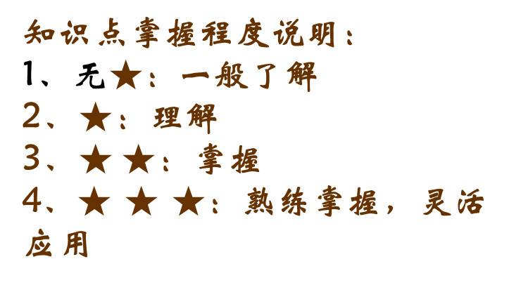
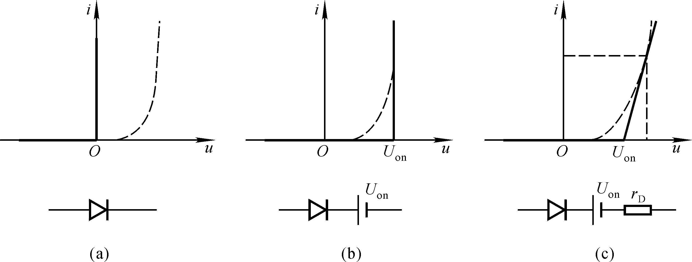
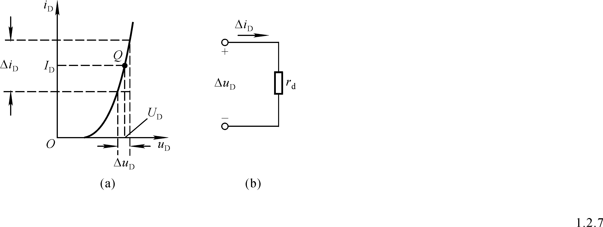

# 2、二极管知识总结

## 内容概览
- 总页数：13
- 图片页数量：4
- 说明：该版本为自动回退模板，建议检查原始提取内容。

## 详细笔记
### 第1页：一、结构
1、点接触型：a、特点结：面积小，结电容小
b、适用场合：小功率整流、高频电路
2、面接触型：a、特点：结面积大，结电容大
b、适用场合：低频工作整流电路
3、平面型：a、特点结：面积可调
b、适用场合：可大功率整流，可做开关管
★ ★二、符号
阴极
阳极
符号
D
§1.2 半导体二极管

### 第2页：★ ★ ★二、伏安特性：非线性
★ ★ ★二、伏安特性：非线性
1、正向导通：
导通压降
击穿电压UBR
锗
开启电压Uon
2、反向截止
反向饱和电流 IS
反向击穿电压 U（BR）
3、温度的影响
开启电压Uon
硅：0.5 V 锗： 0.1 V
导通电压：硅：0.7 V ， 锗：0.2V
反向饱和电流
温度上升：正向特性右移，反向特性下移

### 第3页：★三、主要参数
1、最大整流电流 IF
2、最高反向工作电压UR
3、反向电流 IR
4、最高工作频率fM
★ ★ ★四、等效电路：线性化
1、直流信号作用模型：
（1）理想开关模型：
a、特征：正向UD＝0，反向IS＝0。
b、适用场合：外加电压几十倍于UD
（2）恒压源模型：
a、特征：正向导通UD常数（硅管 0.7V；锗管 0.2V），反向截止IS＝0
b、适用场合：外加电压几倍于UD时

### 第4页：2交流微变等效：直流信号基础上叠加交流信号
2交流微变等效：直流信号基础上叠加交流信号
ui=0时
直流电源作用
小信号作用
（3）电压源串电阻模型：
a、特征： Uon 和rD 需测量
b、适用场合：外加电压接近UD

### 第5页：★ ★ ★四、二极管应用
1、方法：
第一步：选择二极管的等效模型
第二步：断开理想二极管，计算理想二极管的阳极电压 和阴极电压，判断等效模型中理想二极管的工作状态，
第三步：由第二步得到对应电路，应用电路知识进行求解

### 第6页：例1：
例1：
硅材料二极管，UD=0.7V.试求不同电压情况下的输出电流I。
解：
应根据不同输入电压选择不同的等效电路！
50V？5V？1V？
2、例题

### 第7页：第7页
原文不清晰

### 第8页：电路如图，二极管为理想二极管求：UAB
电路如图，二极管为理想二极管求：UAB
V阳 =－6 V V阴 =－12 V
V阳>V阴 二极管导通
UAB =－ 6V
例2：
解： 取 B 点作参考点，断开二极管，分析二极管阳极和阴极的电位。
说明：二极管起钳位作用
D
6V
12V
3k
B
A
UAB
+
–

### 第9页：ui > 8V，二极管导通， uo = 8V
ui > 8V，二极管导通， uo = 8V
ui < 8V，二极管截止，uo = ui
已知：
二极管是理想的，试画出 uo 波形。
8V
例3：
小结：二极管的用途
整流、检波、限幅、钳位、开关、元件保护、
温度补偿等。
ui
15V
参考点
分析：二极管阴极电位为 8 V
D
8V
R
uo
ui
+
+
–
–

### 第10页：例题4：
例题4：
试画出电压uo的波形。
uo
+
-
R
ui
UREF
+
-
D
0
-4V
4V
ui
t
UREF
uo
t
UREF
解：
（1）ui>UREF时，
（2）ui<UREF时，

### 第11页：五、稳压二极管
五、稳压二极管
★ ★ 2、伏安特性
＋
－
DZ
a、正向导通，反向特性：
b、反向：I <IZmin 时，不稳压，截至
c、 IZM > I > IZmin时，稳压
D1
D2
UZ
rz
u
i
UZ
IZmin
正向导通与
二极管相同
3、等效电路：
1、符号：

### 第12页：3、主要参数
3、主要参数
rZ越小，稳压效果越好；
（2）稳定电流IZ（IZmin）
u
i
UZ
IZmin
IZM
（3）额定功耗PZM：PZM=UZ IZM ；
（4）动态电阻rZ：
（1）稳压值UZ；
（5）温度系数α：
IZM
---最大稳定电流

### 第13页：★ ★ 4、应用
★ ★ 4、应用
串联限流电阻，使 IZM > I > IZmin
UI
DZ
IR
IZ
IL
RL
R
UZ
+
+
-
-
小结：稳压管稳压条件

## 关键概念
- 一、结构
- ★ ★ ★二、伏安特性：非线性
- ★三、主要参数
- 2交流微变等效：直流信号基础上叠加交流信号
- ★ ★ ★四、二极管应用
- 例1：
- 第7页
- 电路如图，二极管为理想二极管求：UAB

## 重要知识点
- 一、结构
- 1、点接触型：a、特点结：面积小，结电容小
- b、适用场合：小功率整流、高频电路
- 2、面接触型：a、特点：结面积大，结电容大
- b、适用场合：低频工作整流电路
- 3、平面型：a、特点结：面积可调
- b、适用场合：可大功率整流，可做开关管
- ★ ★二、符号
- 阴极
- 阳极
- 符号
- D

## 复习提纲
1. 先通读“内容概览”和“关键概念”。
2. 按“详细笔记”逐页复盘，重点关注定义、结论、步骤。
3. 对照“重要知识点”进行口头复述和默写。

## 自测题
1. 本文档中最核心的 3 个概念是什么？
2. 任选一页，概述其关键知识点与应用场景。
3. 哪些内容在原文中不清晰，需要回看课件？
