# 3-集成运算放大电路

## 内容概览
- 总页数：73
- 图片页数量：24
- 说明：该版本为自动回退模板，建议检查原始提取内容。

## 详细笔记
### 第1页：模拟电子技术基础 Fundamentals of Analog Electronic
第三章 集成运算放大电路

### 第2页：第三章 集成运算放大电路
§3.1 多级放大电路的一般问题
§3.2 集成运算放大电路概述
§3.3 集成运放中的单元电路
§3.4 集成运放内部电路简介
§3.5 集成运放的性能指标及低频等效电路
§3.6 集成运放的种类及选择
§3.7 集成运放的使用

### 第3页：§3.1 多级放大电路的一般问题
一、多级放大电路的耦合方式
二、多级放大电路的动态分析

### 第4页：1、直接耦合
既是第一级的集电极电阻，又是第二级的基极电阻
能够放大变化缓慢的信号，便于集成化， Q点相互影响，存在零点漂移现象。
当输入信号为零时，前级由温度变化所引起的电流、电位的变化会逐级放大。
第二级
第一级
Q1合适吗？
直接连接
输入为零，输出产生变化的现象称为零点漂移
求解Q点时应按各回路列多元一次方程，然后解方程组。
一、多级放大电路的耦合方式

### 第5页：如何设置合适的静态工作点？
对哪些动态参数产生影响？
用什么元件取代Re既可设置合适的Q点，又可使第二级放大倍数不至于下降太多？
若要UCEQ＝5V，则应怎么办？用多个二极管吗？
二极管导通电压UD≈？动态电阻rd特点？
Re
必要性？
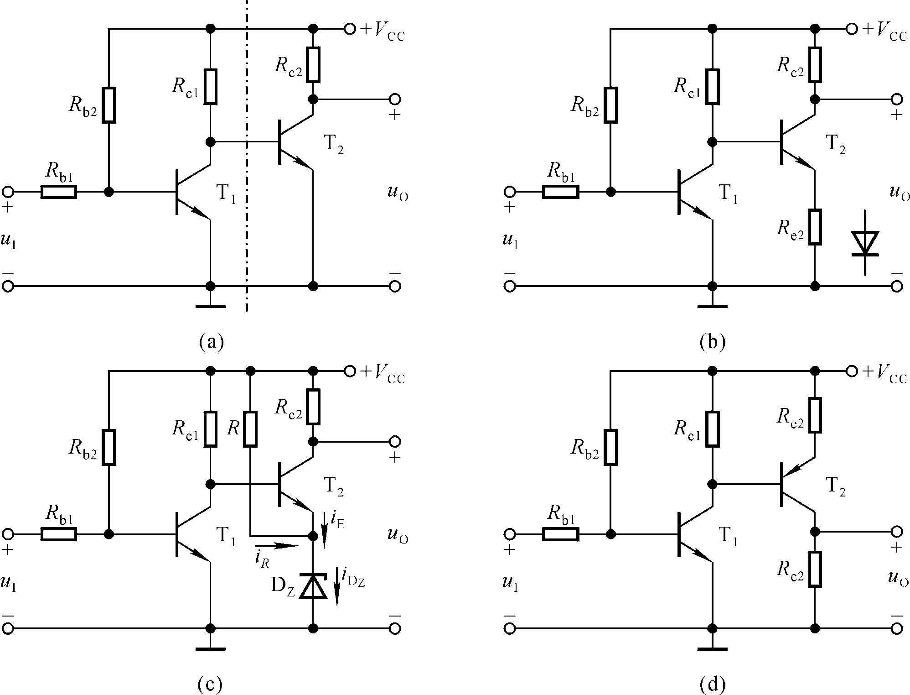

### 第6页：如何设置合适的静态工作点？
若要UCEQ＝5V，则应怎么办？用多个二极管吗？
稳压管
伏安特性
UCEQ1太小→加Re（Au2数值↓）→改用D→若要UCEQ1大，则改用DZ。

### 第7页：NPN型管和PNP型管混合使用
在用NPN型管组成N级共射放大电路，由于UCQi＞ UBQ i，所以 UCQi＞ UCQ(i-1）（i=1～N），以致于后级集电极电位接近电源电压，Q点不合适。
UCQ1 （ UBQ2 ） ＞ UBQ1
UCQ2 ＜ UCQ1
UCQ1 （ UBQ2 ） ＞ UBQ1
UCQ2 ＞ UCQ1
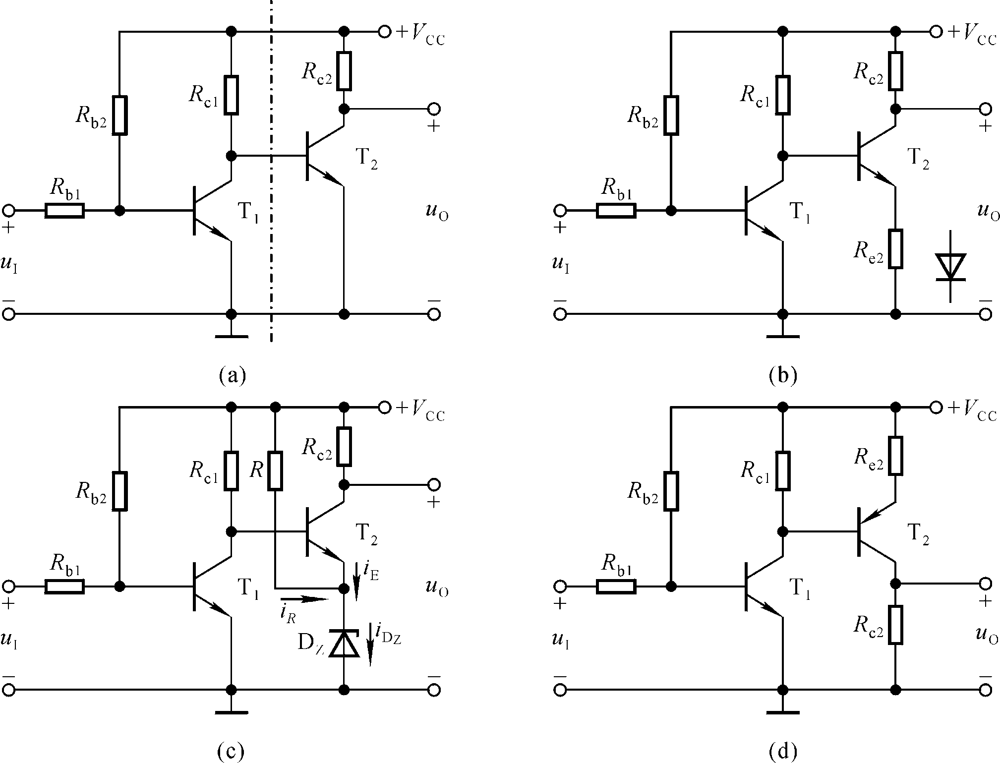

### 第8页：2.阻容耦合
Q点相互独立。不能放大变化缓慢的信号，低频特性差，不能集成化。
共射电路
共集电路
有零点漂移吗？
利用电容连接信号源与放大电路、放大电路的前后级、放大电路与负载，为阻容耦合。
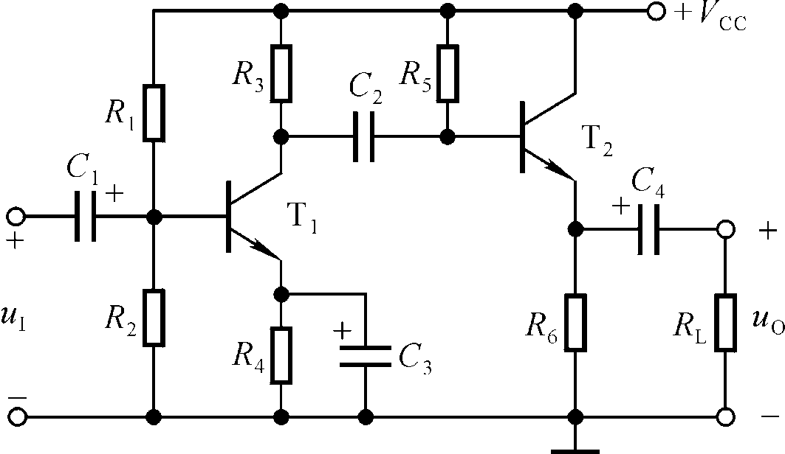

### 第9页：3.变压器耦合
可能是实际的负载，也可能是下级放大电路
理想变压器情况下，负载上获得的功率等于原边消耗的功率。
从变压器原边看到的等效电阻
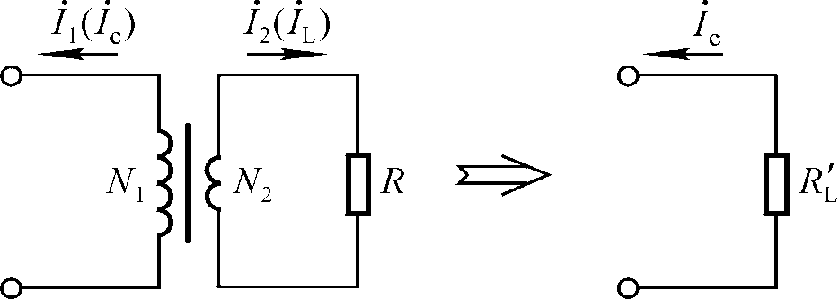
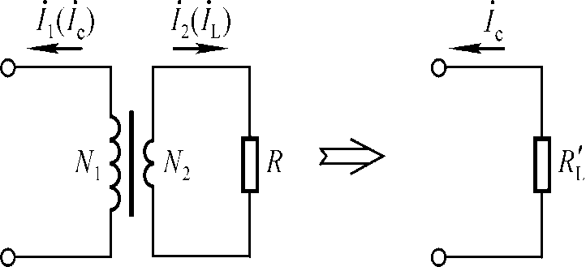

### 第10页：讨论：两级直接耦合放大电路
选择合适参数使电路正常工作
电位高低关系

### 第11页：从Multisim “参数扫描” 结果分析两级放大电路Q点的相互影响。 R1取何值时T2工作在饱和区？
uC1
uC2
T2工作在放大区
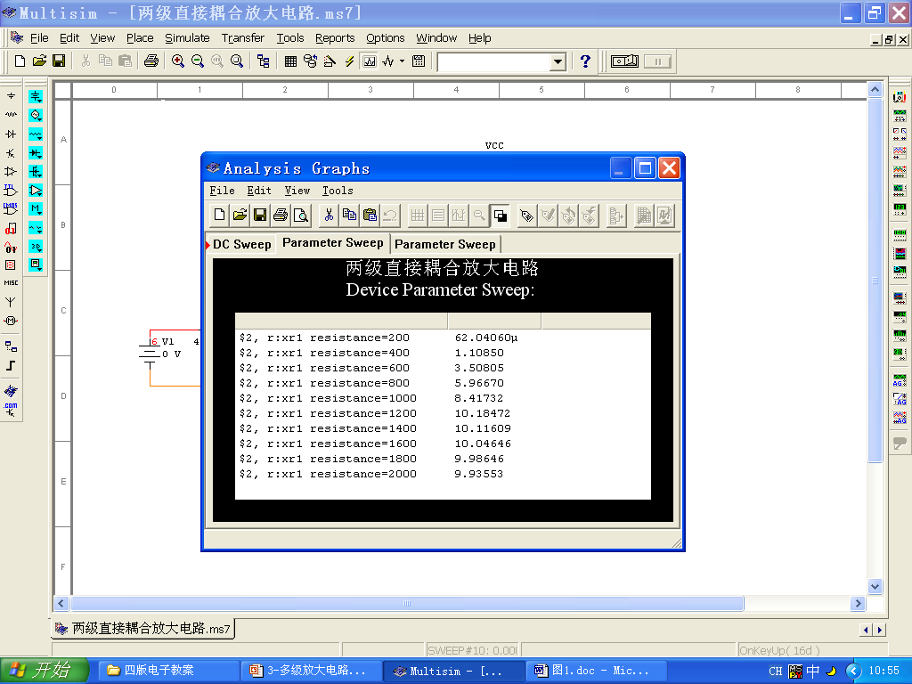
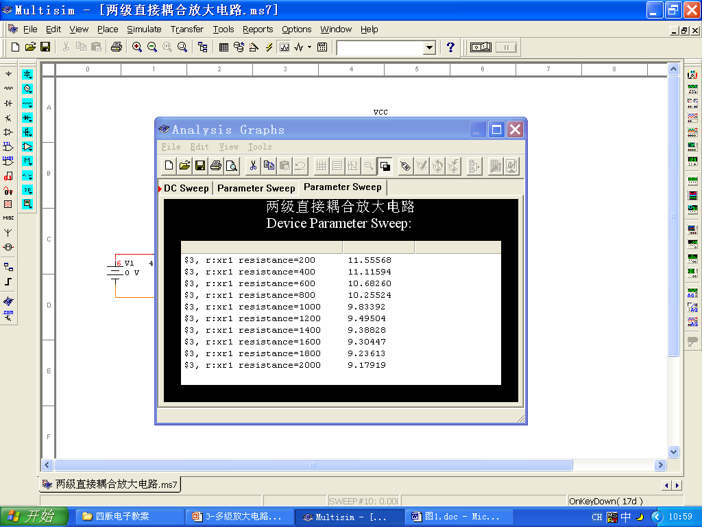

### 第12页：二、多级放大电路的动态分析
1.动态参数分析
（1）电压放大倍数
（2）输入电阻
（3）输出电阻
对电压放大电路的要求：Ri大， Ro小，Au的数值大，最大不失真输出电压大。
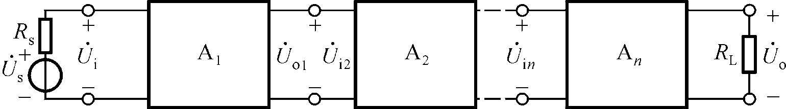

### 第13页：2.分析举例
该页主要为图片内容。
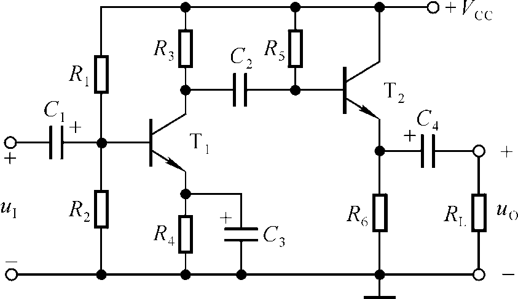
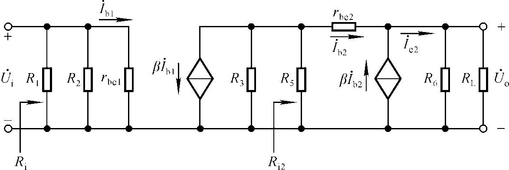

### 第14页：讨论一 失真分析：由NPN型管组成的两级共射放大电路
共射放大电路
共射放大电路
饱和失真？截止失真？
首先确定在哪一级出现了失真，再判断是什么失真。
比较Uom1和Uim2，则可判断在输入信号逐渐增大时哪一级首先出现失真。
在前级均未出现失真的情况下，多级放大电路的最大不失真电压等于输出级的最大不失真电压。
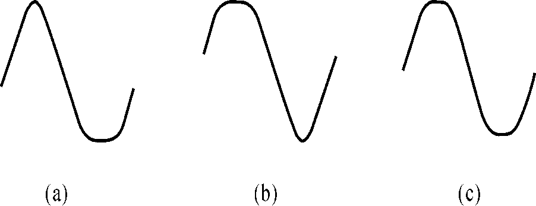

### 第15页：讨论二：放大电路的选用
清华大学 华成英 hchya@tsinghua.edu.cn
1. 按下列要求组成两级放大电路：
① Ri＝1～2kΩ，Au 的数值≥3000；
② Ri ≥ 10MΩ，Au的数值≥300；
③ Ri＝100～200kΩ，Au的数值≥150；
④ Ri ≥ 10MΩ ，Au的数值≥10，Ro≤100Ω。
①共射、共射；②共源、共射；③共集、共射；④共源、共集。
2. 若测得三个单管放大电路的输入电阻、输出电阻和空载电压放大倍数，则如何求解它们连接后的三级放大电路的电压放大倍数？
注意级联时两级的相互影响！

### 第16页：§3.2 集成运算放大电路概述
一、集成运放的电路结构特点
二、集成运放的组成和各部分的作用
三、集成运放的电压传输特性

### 第17页：一、集成运放的电路结构特点
（1）直接耦合方式，充分利用管子性能良好的一致性采用差分放大电路和电流源电路。
（2）用复杂电路实现高性能的放大电路，因为电路的复杂化并不带来工艺的复杂性。
（3）用有源元件替代无源元件，如用晶体管取代难于制作的大电阻。
（4）采用复合管。
集成运算放大电路，简称集成运放，是一个高性能的直接耦合多级放大电路。因首先用于信号的运算，故而得名。

### 第18页：二、集成运放电路的组成和各部分的作用
两个
输入端
一个
输出端
若将集成运放看成为一个“黑盒子”，则可等效为一个双端输入、单端输出的差分放大电路。
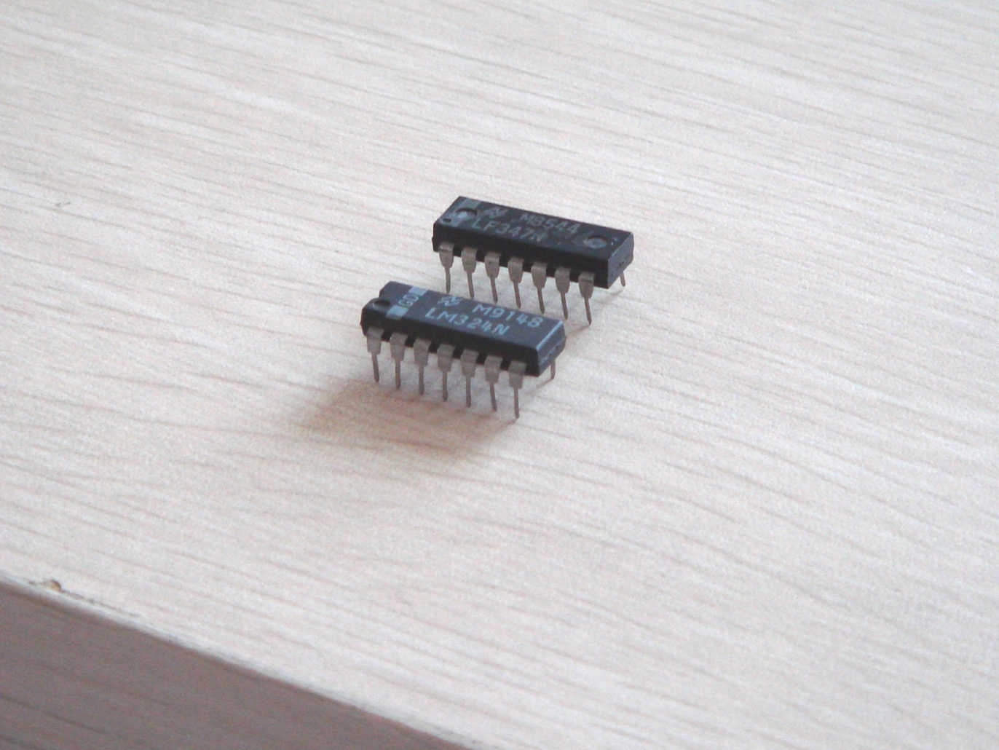

### 第19页：集成运放电路四个组成部分的作用
输入级：前置级，多采用差分放大电路。要求Ri大，Ad大， Ac小，输入端耐压高。
中间级：主放大级，多采用共射放大电路。要求有足够的放大能力。
输出级：功率级，多采用准互补输出级。要求Ro小，最大不失真输出电压尽可能大。
偏置电路：为各级放大电路设置合适的静态工作点。采用电流源电路。
几代产品中输入级的变化最大！

### 第20页：三、集成运放的电压传输特性
由于Aod高达几十万倍，所以集成运放工作在线性区时的最大输入电压(uP－uN)的数值仅为几十～一百多微伏。
在线性区：
uO＝Aod(uP－uN)
Aod是开环差模放大倍数。
非线性区
(uP－uN)的数值大于一定值时，集成运放的输出不是＋UOM , 就是－UOM，即集成运放工作在非线性区。
uO=f(uP-uN)

### 第21页：一、 直接耦合放大电路的零点漂移现象
一、 直接耦合放大电路的零点漂移现象
二、差分放大电路
三、电流源电路
四、直接耦合互补输出级
§3.3 集成运放中的单元电路

### 第22页：一、直接耦合放大电路的零点漂移现象
1. 什么是零点漂移现象：ΔuI＝0，ΔuO≠0的现象。
2.产生的原因：
温度变化，直流电源波动，元器件老化。其中晶体管的特性对温度敏感是主要原因，故也称零漂为温漂。
克服温漂的方法：引入直流负反馈，温度补偿。
典型电路：差分放大电路
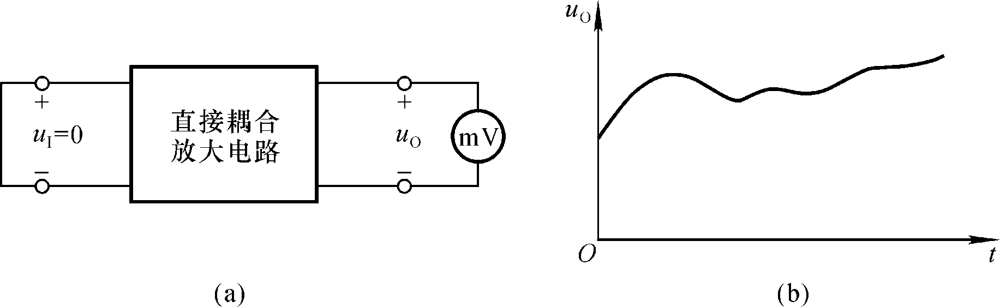

### 第23页：二、差分放大电路
1.长尾式差分放大电路的组成
2.长尾式差分放大电路的分析
3.差分放大电路的四种接法
4.具有恒流源的差分放大电路
5.差分放大电路的改进

### 第24页：1.长尾式差分放大电路的组成
零点漂移
零输入零输出
理想对称
信号特点？能否放大？
共模信号：大小相等，极性相同。
差模信号：大小相等，极性相反.
信号特点？能否放大？

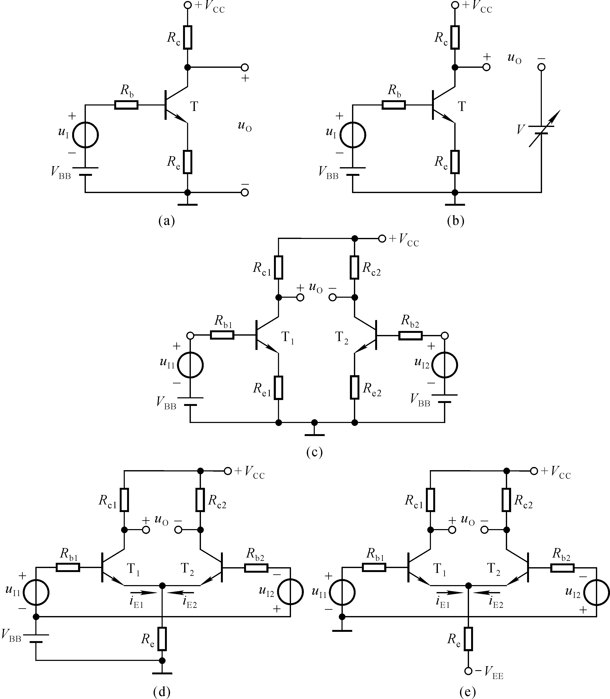

### 第25页：典型电路
在理想对称的情况下：
1. 克服零点漂移；
2. 零输入零输出；
3. 抑制共模信号；
4. 放大差模信号。

### 第26页：2.长尾式差分放大电路的分析
Rb是必要的吗？
（1）Q点：
晶体管输入回路方程：
通常，Rb较小，且IBQ很小，故
选合适的VEE和Re就可得合适的Q

### 第27页：（2）抑制共模信号
共模信号：数值相等、极性相同的输入信号，即

### 第28页：（2）抑制共模信号 ：Re的共模负反馈作用
Re的共模负反馈作用：温度变化所引起的变化等效为共模信号
对于每一边电路，Re=?
如 T(℃)↑→IC1↑ IC2 ↑→UE↑→ IB1 ↓IB2 ↓→ IC1 ↓ IC2 ↓
抑制了每只差分管集电极电流、电位的变化。

### 第29页：（3）放大差模信号
△iE1=－△ iE2，Re中电流不变，即Re 对差模信号无反馈作用。
差模信号：数值相等，极性相反的输入信号，即
＋
－
＋
－

### 第30页：差模信号作用时的动态分析
为什么？
差模放大倍数
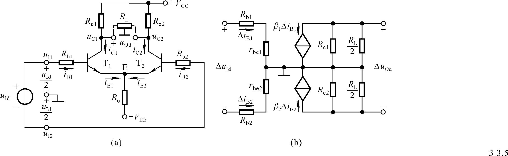

### 第31页：（4）动态参数：Ad、Ri、 Ro、 Ac、KCMR
共模抑制比KCMR：综合考察差分放大电路放大差模信号的能力和抑制共模信号的能力。
在实际应用时，信号源需要有“ 接地”点，以避免干扰；或负载需要有“ 接地”点，以安全工作。
根据信号源和负载的接地情况，差分放大电路有四种接法：双端输入双端输出、双端输入单端输出、单端输入双端输出、单端输入单端输出。

### 第32页：3. 差分放大电路的四种接法
由于输入回路没有变化，所以IEQ、IBQ、ICQ与双端输出时一样。但是UCEQ1≠ UCEQ2。
（1）双端输入单端输出：Q点分析

### 第33页：（1）双端输入单端输出：差模信号作用下的分析
原文不清晰

### 第34页：（1）双端输入单端输出：共模信号作用下的分析
原文不清晰

### 第35页：（1）双端输入单端输出：问题讨论
（1）T2的Rc可以短路吗？
（2）什么情况下Ad为“＋”？
（3）双端输出时的Ad是单端输出时的2倍吗？

### 第36页：（2）单端输入双端输出
共模输入电压
差模输入电压
输入差模信号的同时总是伴随着共模信号输入：
在输入信号作用下发射极的电位变化吗？说明什么？
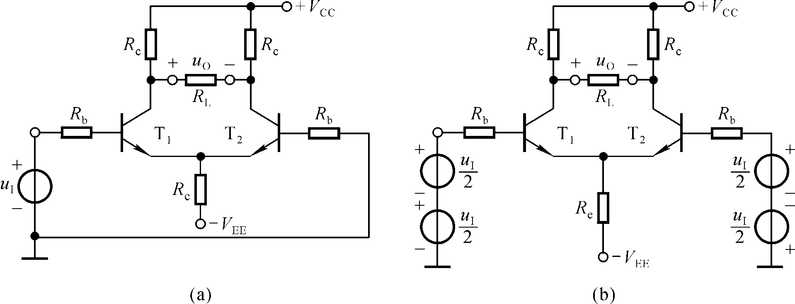
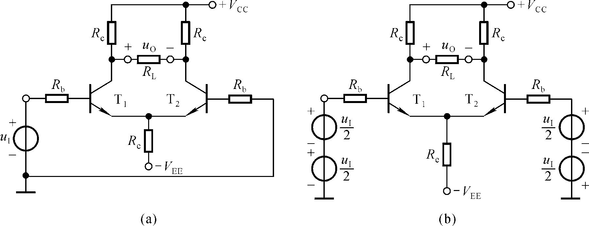

### 第37页：（2）单端输入双端输出
问题讨论：
（1）UOQ产生的原因？
（2）如何减小共模输出电压？
测试:
差模输出
共模输出
静态时的值

### 第38页：（3）四种接法的比较：电路参数理想对称条件下
输入方式： Ri均为2(Rb+rbe)；双端输入时无共模信号输入，单端输入时有共模信号输入。
输出方式：Q点、Ad、 Ac、 KCMR、Ro均与之有关。

### 第39页：4.具有恒流源的差分放大电路
Re 越大，每一边的漂移越小，共模负反馈越强，单端输出时的Ac越小，KCMR越大，差分放大电路的性能越好。
但为使静态电流不变，Re 越大，VEE越大，以至于Re太大就不合理了。
需在低电源条件下，设置合适的IEQ，并得到得到趋于无穷大的Re。
解决方法：采用电流源取代Re！

### 第40页：具有恒流源差分放大电路的组成
等效电阻为无穷大
近似为
恒流
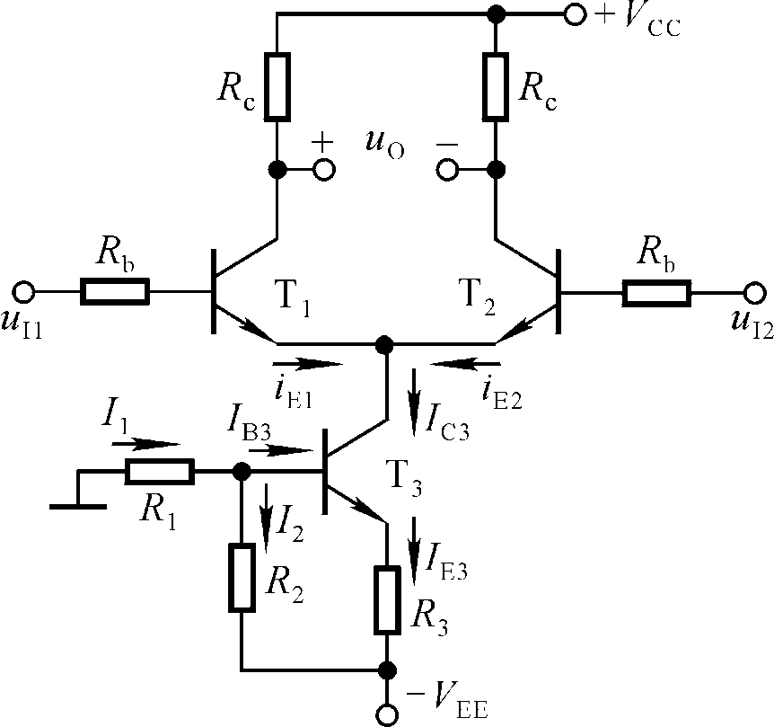

### 第41页：5.差分放大电路的改进
1) RW取值应大些？还是小些？
2) RW对动态参数的影响？
3) 若RW滑动端在中点，写出Ad、Ri的表达式。
（1）加调零电位器 RW
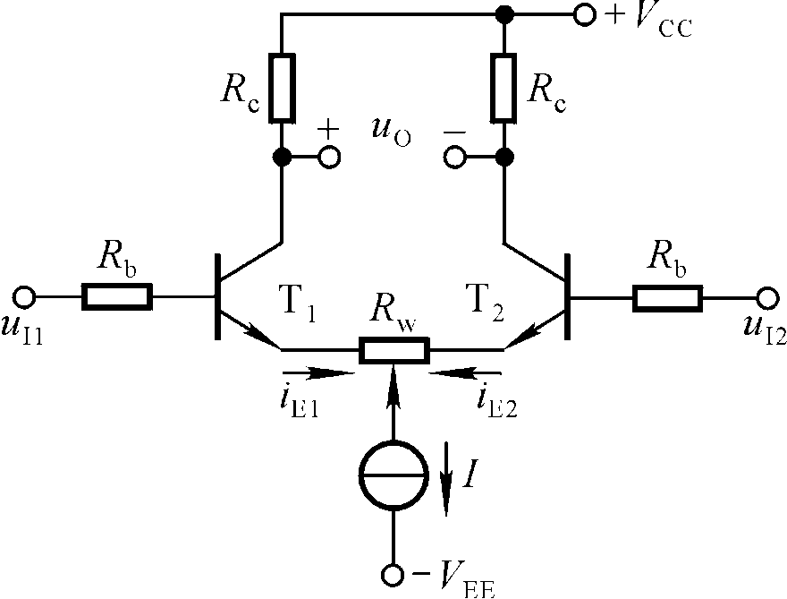

### 第42页：（2）场效应管差分放大电路
该页主要为图片内容。
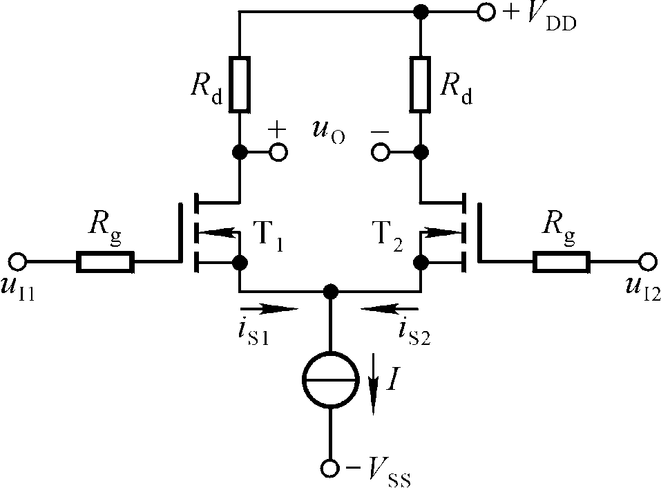

### 第43页：讨论一
若uI1=10mV，uI2=5mV，则uId=？ uIc=？
uId=5mV ，uIc=7.5mV
若将电桥的输出作为差放的输入，则其共模信号约为多少？如何设置Q点时如何考虑？
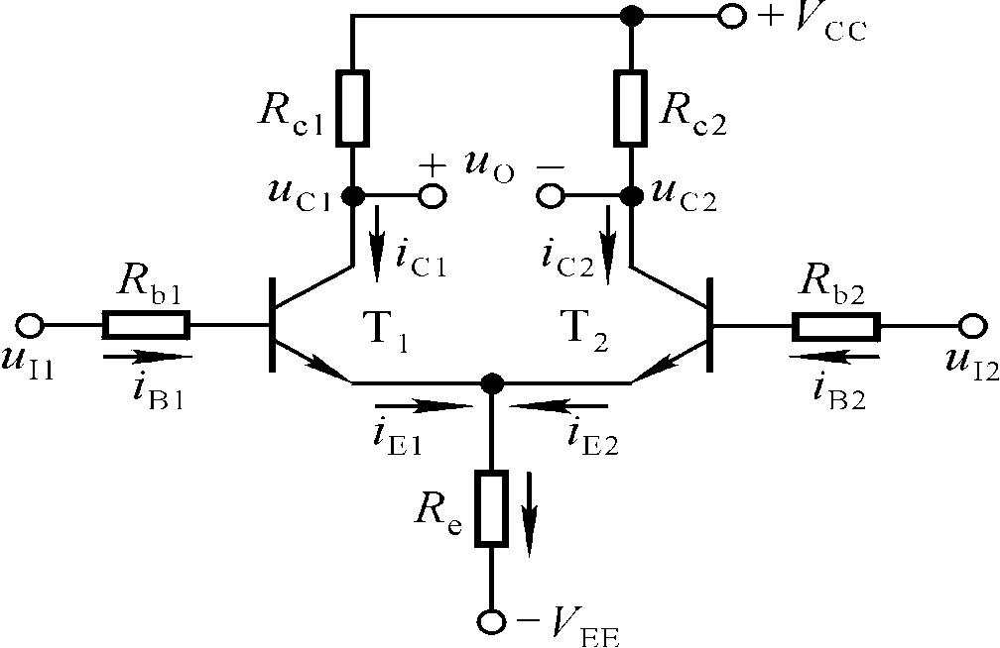

### 第44页：讨论二
1、uI=10mV，则uId=? uIc=?
2、若Ad=－102、KCMR＝103用直流表测uO ，uO=?
uId=10mV ，uIc=5mV
uO= Ad uId+ Ac uIc+UCQ1
=?
=?
=?

### 第45页：三、集成运放中的电流源
1. 镜像电流源
2. 微电流源
3. 多路电流源
4. 有源负载

### 第46页：1.镜像电流源
T0 和 T1 特性完全相同。
在电流源电路中充分利用集成运放中晶体管性能的一致性。
电路中有负反馈吗？
基准电流
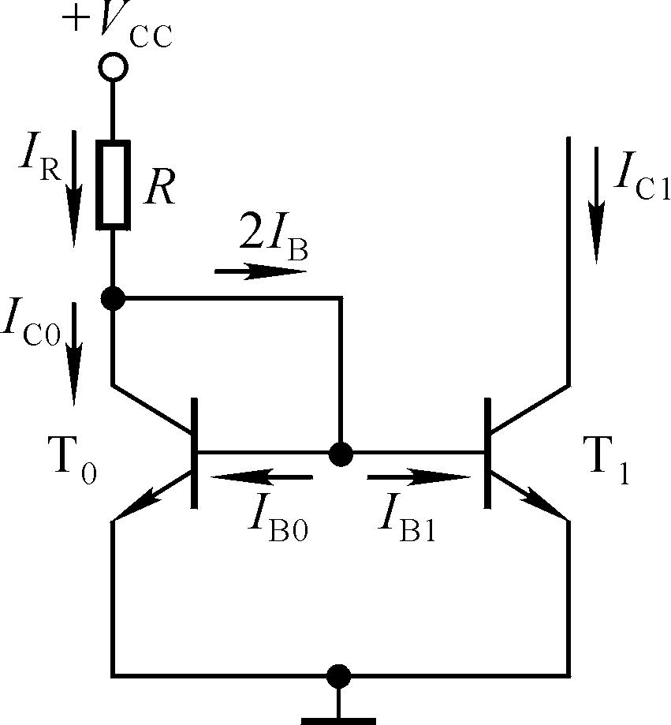

### 第47页：2. 微电流源
设计过程很简单，首先确定IE0和IE1，然后选定R和Re。
超越方程
Re
要求提供很小的静态电流，又不能用大电阻。

### 第48页：3.多路电流源
根据所需静态电流，来选取发射极电阻的数值。
根据所需静态电流，来确定集电结面积。
根据所需静态电流，来确定沟道尺寸。
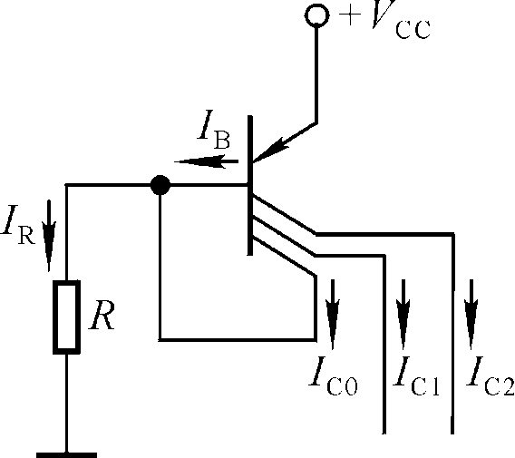
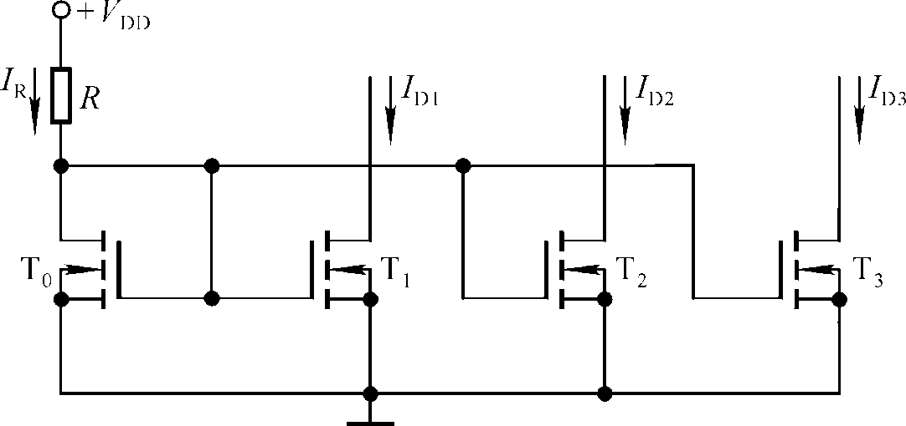

### 第49页：4.有源负载
①哪只管子为放大管？
②其集电结静态电流约为多少？
③静态时UIQ为多少？
④为什么要考虑 h22?
（1）用于共射放大电路
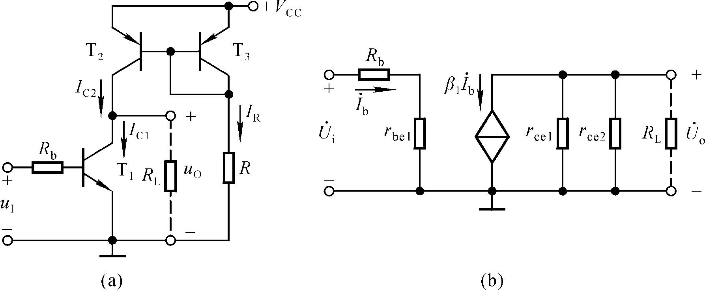
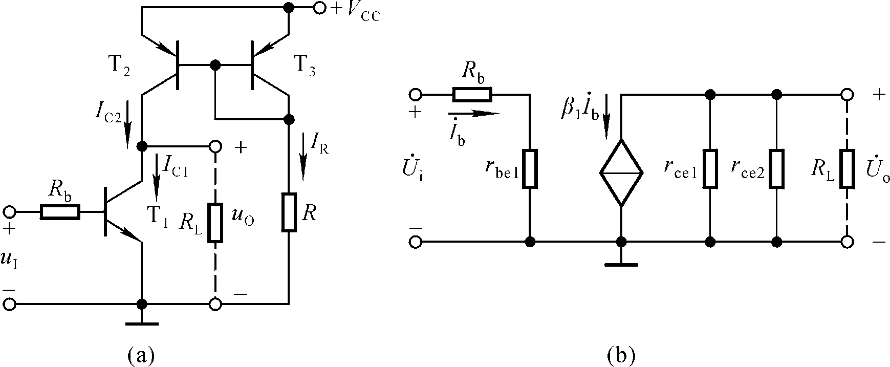

### 第50页：（2）用于差分放大电路
①电路的输入、输出方式？
②如何设置静态电流？
③静态时iO约为多少？
④动态时ΔiO约为多少？
使单端输出电路的差模放大倍数近似等于双端输出时的差模放大倍数。
静态：
动态：

### 第51页：4.互补输出级
2.基本电路
3.消除交越失真的互补输出级
4.准互补输出级
1.对输出级的要求

### 第52页：1.对输出级的要求
互补输出级是直接耦合的功率放大电路。
对输出级的要求：带负载能力强；直流功耗小；负载电阻上无直流功耗；
最大不失真输出电压最大。
射极输出形式
静态工作电流小
输入为零时输出为零
双电源供电时Uom的峰值接近电源电压。
单电源供电Uom的峰值接近二分之一电源电压。
不符合要求！

### 第53页：2.基本电路
静态时T1、T2均截止，UB= UE=0
（1）特征：T1、T2特性理想对称。
（2）静态分析
T1的输入特性
理想化特性

### 第54页：（3）动态分析
ui正半周，电流通路为 +VCC→T1→RL→地， uo = ui
两只管子交替工作，两路电源交替供电，双向跟随。
ui负半周，电流通路为 地→ RL → T2 → -VCC， uo = ui

### 第55页：（4）交越失真
消除失真的方法：
设置合适的静态工作点。
信号在零附近两只管子均截止
开启电压
① 静态时T1、T2处于临界导通状态，有信号时至少有一只导通；
② 偏置电路对动态性能影响要小。
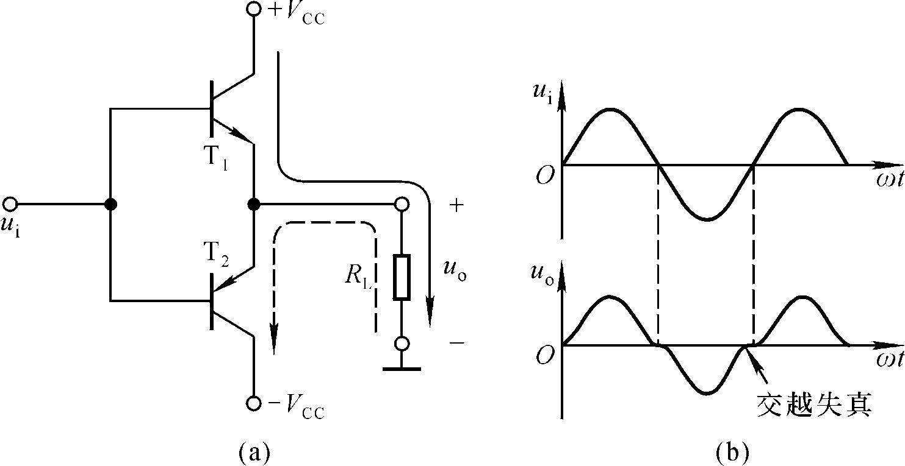

### 第56页：3.消除交越失真的互补输出级
该页主要为图片内容。
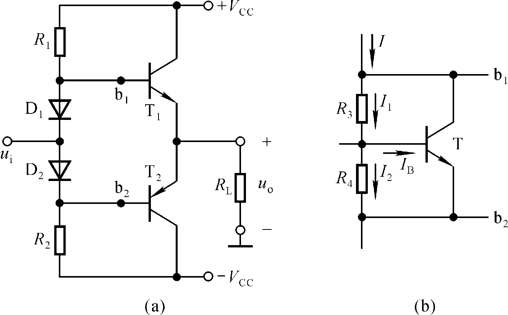
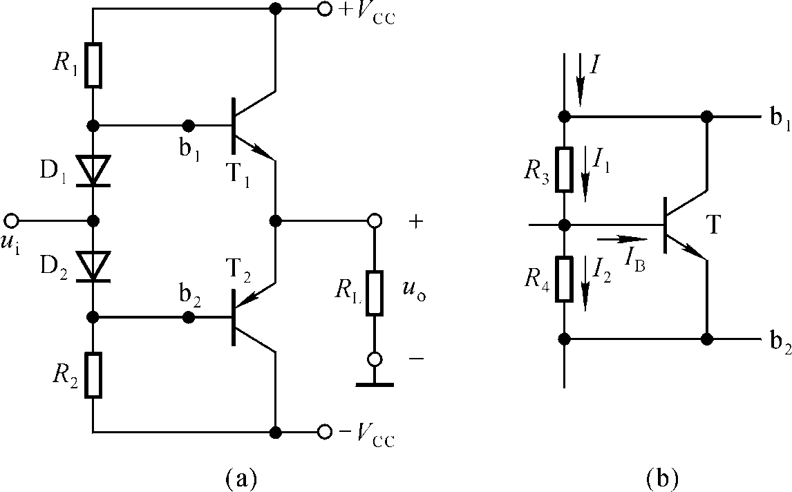

### 第57页：4.准互补输出级
为保持输出管的良好对称性，输出管应为同类型晶体管。
大！
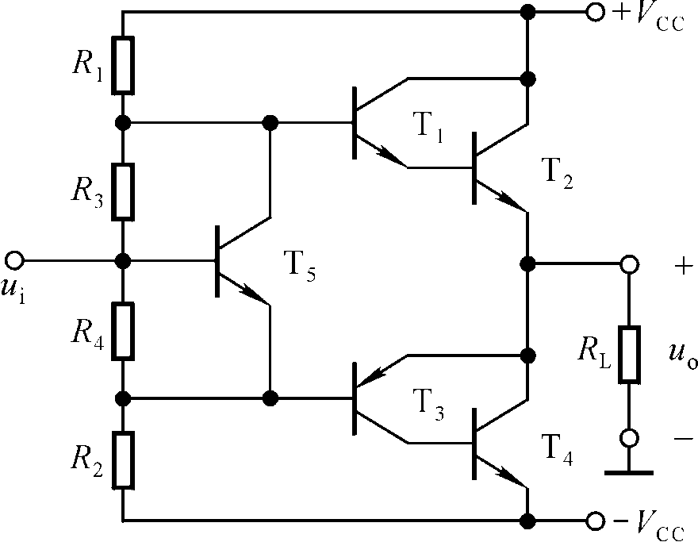

### 第58页：§3.4 集成运放内部电路简介
§3.4 集成运放内部电路简介
一、模拟电路的读图方法
二、双极型集成运放电路
三、集成运放的主要性能指标
四、集成运放的种类

### 第59页：化整为零：将集成运放电路，先将偏置电路分离出来，然后根据信号流通顺序将放大部分分为输入级、中间级和输出级三级；
化整为零：将集成运放电路，先将偏置电路分离出来，然后根据信号流通顺序将放大部分分为输入级、中间级和输出级三级；
分析功能：弄清每一级电路属于哪种基本放大电路、有何性能特点；
统观整体：研究各部分电路相互间的联系，理解电路如何实现所具有的功能；
定量估算：必要时再进行。
一、模拟电路的读图方法：

### 第60页：二、双极型集成运放
第一级：双端输入单端输出的差放
第二级：以复合管为放大管的共射放大电路
第三级：准互补输出级
动态电阻无穷大
（1） 化整为零，识别电路
1.雏型

### 第61页：（2）基本性能分析
输入电阻为2rbe、电压放大倍数较大、输出电阻很小、最大不失真输出电压的峰值接近电源电压。
整个电路可等效为一个双端输入单端输出的差分放大电路。

### 第62页：（3）交流等效电路
可估算低频小信号下的电压放大倍数、输入电阻、输出电阻等。
＋
－
－
＋
＋
＋

### 第63页：2.实例：F007——通用型集成运放
对于集成运放电路，应首先找出偏置电路，然后根据信号流通顺序，将其分为输入级、中间级和输出级电路。

### 第64页：找出偏置电路
若在集成运放电路中能够估算出某一支路的电流，则这个电流往往是偏置电路中的基准电流。

### 第65页：简化电路 分解电路
双端输入、单端输出差分放大电路
以复合管为放大管、恒流源作负载的共射放大电路
用UBE倍增电路消除交越失真的准互补输出级
三级放大电路

### 第66页：输入级的分析
T3、T4为横向PNP型管，输入端耐压高。共集形式，输入电阻大，允许的共模输入电压幅值大。共基形式频带宽。
共集-共基形式
Q点的稳定：
T（℃）↑→IC1↑ IC2↑ →IC8↑
IC9与IC8为镜像关系→IC9↑，因IC10不变→ IB3↓ IB4↓ → IC3 ↓ IC4↓→ IC1↓ IC2↓
T1和T2从基极输入、射极输出
T3和T4从射极输入、集电极输出

### 第67页：输入级的分析
T7的作用：抑制共模信号
T5、T6分别是T3、T4的有源负载，而T4又是T6的有源负载，增大电压放大倍数。
作用？
+
+
+
+
+
+
+
_
放大差模信号
+
_
_
_
特点：
输入电阻大、差模放大倍数大、共模放大倍数小、输入端耐压高，并完成电平转换（即对“地”输出）。

### 第68页：中间级的分析
中间级是主放大器，它所采取的一切措施都是为了增大放大倍数。
F007的中间级是以复合管为放大管、采用有源负载的共射放大电路。由于等效的集电极电阻趋于无穷大，故动态电流几乎全部流入输出级。
中间级
输出级

### 第69页：输出级的分析
D1和D2起过流保护作用，未过流时，两只二极管均截止。
iO增大到一定程度，D1导通，为T14基极分流，从而保护了T14。
准互补输出级，UBE倍增电路消除交越失真。
中间级
输出级
电流采样电阻
特点：
输出电阻小
最大不失真输出电压高

### 第70页：判断同相输入端和反相输入端
输入电阻大、差模增益大、输出电阻小、共模抑制能力强、允许的共模输入电压高、输入端耐压高等。

### 第71页：三、集成运放的主要性能指标
指标参数 F007典型值 理想值
开环差模增益 Aod 106dB ∞
差模输入电阻 rid 2MΩ ∞
共模抑制比 KCMR 90dB ∞
输入失调电压 UIO 1mV 0
UIO的温漂d UIO/dT(℃) 几μV/ ℃ 0
输入失调电流 IIO (│ IB1- IB2 │) 20nA 0
UIO的温漂d UIO/dT(℃) 几nA/ ℃ 0
最大共模输入电压 UIcmax ±13V
最大差模输入电压 UIdmax ±30V
-3dB带宽 fH 10Hz ∞
转换速率 SR(=duO/dt│max) 0.5V/μS ∞
20lg│Aod│
使uO为0在输入端所加的补偿电压
超过此值不能正常放大差模信号
超过此值输入级放大管击穿

### 第72页：四、集成运放的种类
按照性能特点分类：
①通用性 ②高阻型 ③高速型 ④高精度型
⑤低功耗型 ⑥高电压型 ⑦大功率型
（1）作低频放大器，应选用 。
（2）作宽频带放大器，应选用 。
（3）作幅值为1μV以下微弱信号的测量放大器，应选用 。
（4）作内阻为100kΩ信号源的放大器，应选用 。
（5）负载需5A电流驱动的放大器，应选用 。
（6）要求输出电压幅值为±80V的放大器，应选用 。
（7）宇航仪器中所用的放大器，应选用 。

### 第73页：讨论
1. 输入级采用什么措施增大放大倍数？
2. 中间级采用什么措施增大电压放大倍数？
3. 如何消除交越失真？
4. uI1、 uI3哪个是同相输入端？哪个是反相输入端？
有源负载
有源负载
复合管共射放大电路
增大输入级的负载电阻
_
_
+
_
_
_
+
+
反相
输入端
同相
输入端
积累电流放大系数
超β管

## 关键概念
- 模拟电子技术基础 Fundamentals of Analog Electronic
- 第三章 集成运算放大电路
- §3.1 多级放大电路的一般问题
- 1、直接耦合
- 如何设置合适的静态工作点？
- NPN型管和PNP型管混合使用
- 2.阻容耦合
- 3.变压器耦合

## 重要知识点
- 模拟电子技术基础 Fundamentals of Analog Electronic
- 第三章 集成运算放大电路
- 第三章 集成运算放大电路
- §3.1 多级放大电路的一般问题
- §3.2 集成运算放大电路概述
- §3.3 集成运放中的单元电路
- §3.4 集成运放内部电路简介
- §3.5 集成运放的性能指标及低频等效电路
- §3.6 集成运放的种类及选择
- §3.7 集成运放的使用
- §3.1 多级放大电路的一般问题
- 一、多级放大电路的耦合方式

## 复习提纲
1. 先通读“内容概览”和“关键概念”。
2. 按“详细笔记”逐页复盘，重点关注定义、结论、步骤。
3. 对照“重要知识点”进行口头复述和默写。

## 自测题
1. 本文档中最核心的 3 个概念是什么？
2. 任选一页，概述其关键知识点与应用场景。
3. 哪些内容在原文中不清晰，需要回看课件？
