# 4-放大电路的频率响应.ppt

## 内容概览
- 总页数：38
- 图片页数量：16
- 说明：该版本为自动回退模板，建议检查原始提取内容。

## 详细笔记
### 第1页：模拟电子技术基础 Fundamentals of Analog Electronic
第四章 放大电路的频率响应

### 第2页：第五章 放大电路的频率响应
§4.1 频率响应的有关概念
§4.2 晶体管的高频等效电路
§4.3 放大电路的频率响应

### 第3页：§4.1 频率响应的有关概念
一、本章要研究的问题
二、高通电路和低通电路
三、放大电路中的频率参数

### 第4页：一、研究的问题
放大电路对信号频率的适应程度，即信号频率对放大倍数的影响。
由于放大电路中耦合电容、旁路电容、半导体器件极间电容的存在，使放大倍数为频率的函数。
在使用一个放大电路时应了解其信号频率的适用范围，在设计放大电路时，应满足信号频率的范围要求。

### 第5页：二、高通电路和低通电路
使输出电压幅值下降到70.7%，相位为±45º的信号频率为下限截止频率。
1. 高通电路:信号频率越高，输出电压越接近输入电压。
高通电路
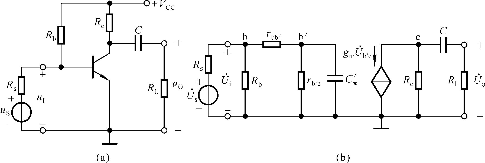

### 第6页：二、高通电路和低通电路
2. 低通电路:信号频率越低，输出电压越接近输入电压。
使输出电压幅值下降到70.7%，相位为±45º的信号频率为上限截止频率。
结电容
低通电路

### 第7页：三、放大电路中的频率参数
在低频段，随着信号频率逐渐降低，耦合电容、旁路电容等的容抗增大，使动态信号损失，放大能力下降。
在高频段，随着信号频率逐渐升高，晶体管极间电容和分布电容、寄生电容等杂散电容的容抗减小，使动态信号损失，放大能力下降。
下限频率
上限频率

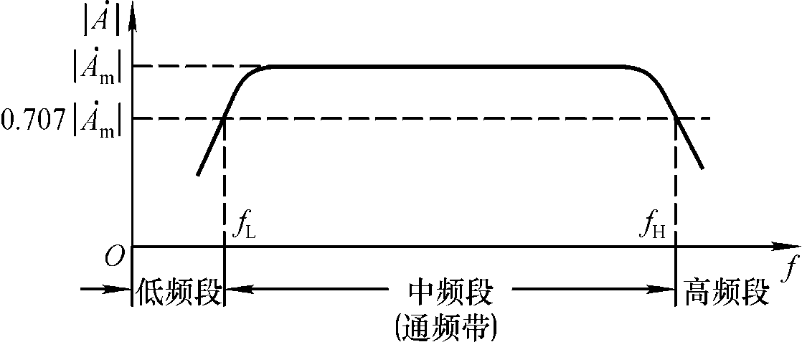

### 第8页：§4.2 晶体管的高频等效电路
一、混合π模型
二、电流放大倍数的频率响应
三、晶体管的频率参数

### 第9页：一、混合π模型
1. 模型的建立：由结构而建立，形状像Π，参数量纲各不相同。
gm为跨导，它不随信号频率的变化而变。
阻值小
阻值大
连接了输入回路和输出回路
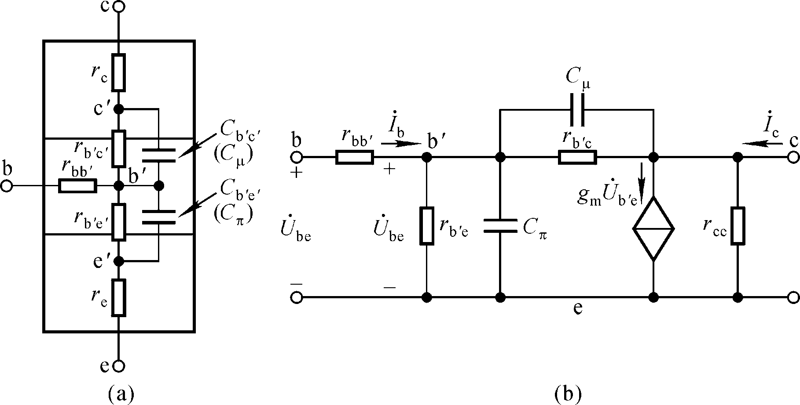
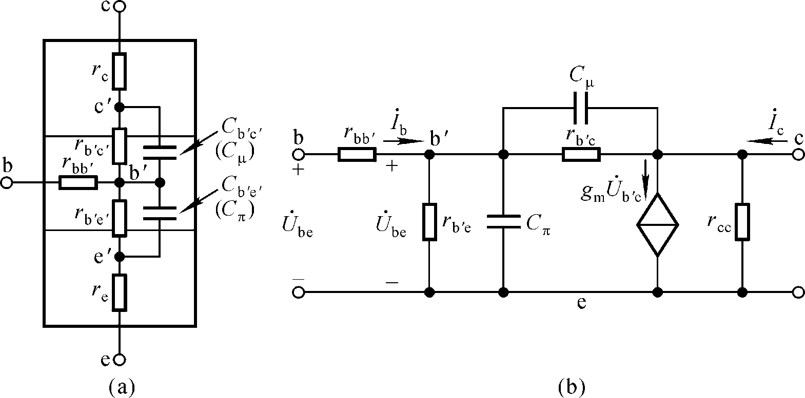

### 第10页：2. 混合π模型的单向化（使信号单向传递）
等效变换后电流不变
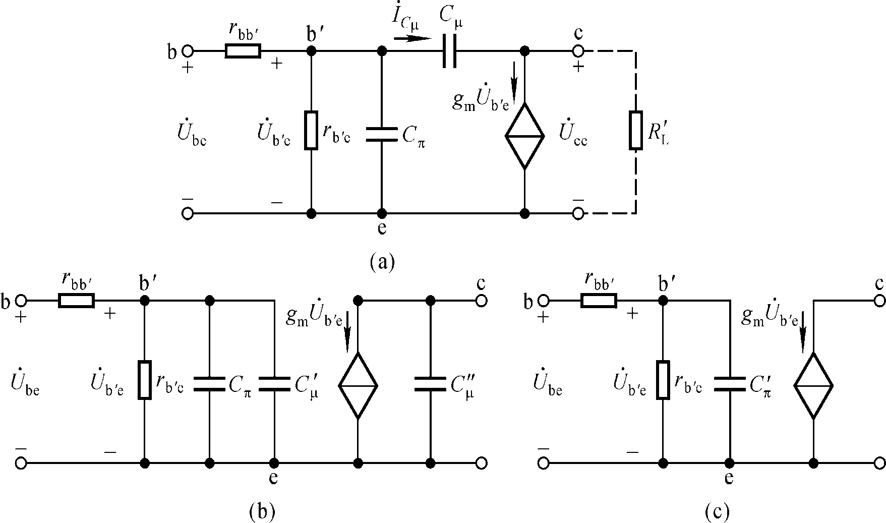

### 第11页：3. 晶体管简化的高频等效电路
3. 晶体管简化的高频等效电路
＝？

### 第12页：二、电流放大倍数的频率响应
为什么短路？
1. 适于频率从0至无穷大的表达式
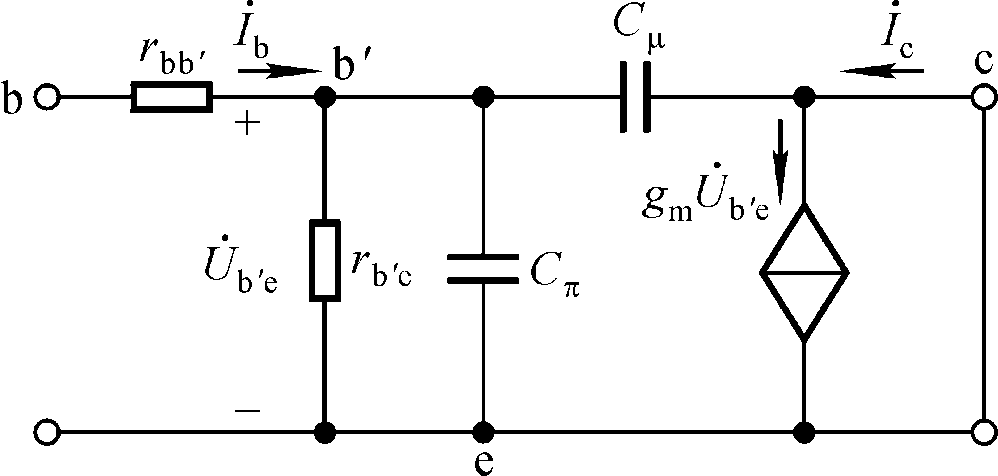

### 第13页：2. 电流放大倍数的频率特性曲线
原文不清晰

### 第14页：3. 电流放大倍数的波特图: 采用对数坐标系
采用对数坐标系，横轴为lg f，可开阔视野；纵轴为 单位为“分贝” （dB），使得 “ ×” →“ ＋” 。
lg f
注意折线化曲线的误差
－20dB/十倍频
折线化近似画法
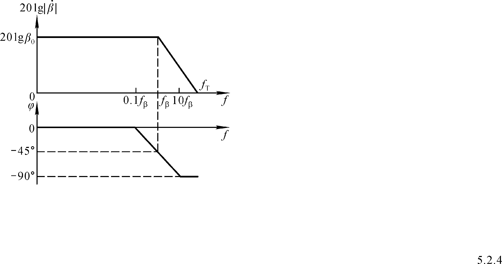

### 第15页：三、晶体管的频率参数
共射截止频率
共基截止频率
特征频率
集电结电容
通过以上分析得出的结论：
① 低频段和高频段放大倍数的表达式；
② 截止频率与时间常数的关系；
③ 波特图及其折线画法；
④ Cπ的求法。
手册查得

### 第16页：讨论一
1. 若干个放大电路的放大倍数分别为1、10、102、103、104、105，它们的增益分别为多少？
2. 为什么波特图开阔了视野？同样长度的横轴，在单位长度不变的情况下，采用对数坐标后，最高频率是原来的多少倍？
10
20
30
40
50
60
O
f
10
102
103
104
105
106
lg f

### 第17页：讨论二
电路如图。已知各电阻阻值；静态工作点合适，集电极电流ICQ＝2mA；晶体管的rbb’=200Ω，Cob=5pF， fβ=1MHz。
试求解该电路中晶体管高频等效模型中的各个参数。

### 第18页：讨论二
原文不清晰

### 第19页：§4.3 放大电路的频率响应
一、单管共射放大电路的频率响应
二、多级放大电路的频率响应

### 第20页：一、单管共射放大电路的频率响应
适用于信号频率从0～∞的交流等效电路
中频段：C 短路， 开路。
低频段：考虑C 的影响， 开路。
高频段：考虑 的影响，C 开路。

### 第21页：1. 中频电压放大倍数
带负载时：
空载时：
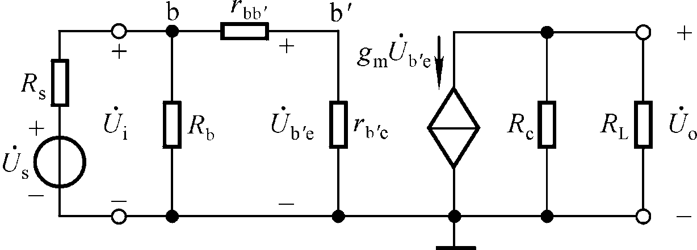

### 第22页：2. 低频电压放大倍数:定性分析
该页主要为图片内容。
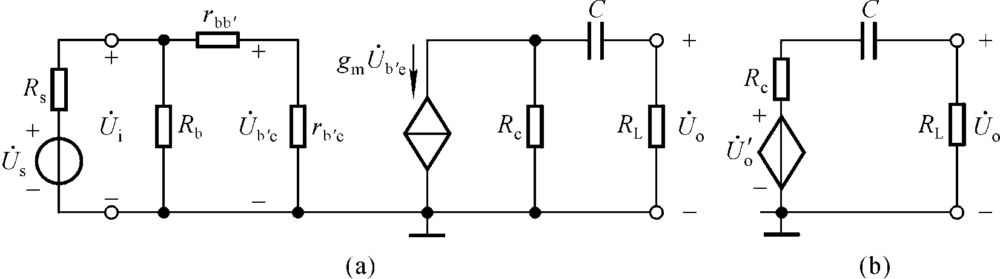

### 第23页：2. 低频电压放大倍数：定量分析
C所在回路的时间常数？

### 第24页：2. 低频电压放大倍数：低频段频率响应分析
中频段
20dB/十倍频
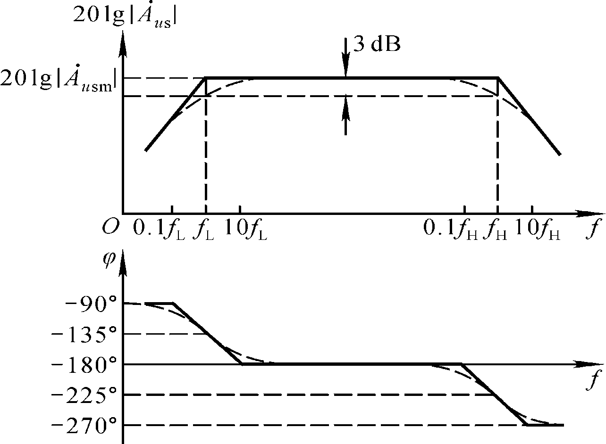

### 第25页：截止频率与电容所在回路时间常数的关系
截止频率与电容所在回路时间常数的关系
τ是决定电路截止频率的电容所在回路的时间常数。
求解截止频率，关键是找出决定截止频率的电容，然后找出该电容所在回路的等效电阻，并求出时间常数。

### 第26页：3. 高频电压放大倍数：定性分析
该页主要为图片内容。

### 第27页：3. 高频电压放大倍数：定量分析
可直接得出
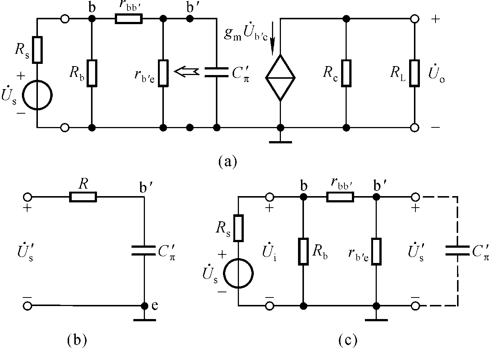

### 第28页：3. 高频电压放大倍数：高频段频率响应分析
该页主要为图片内容。
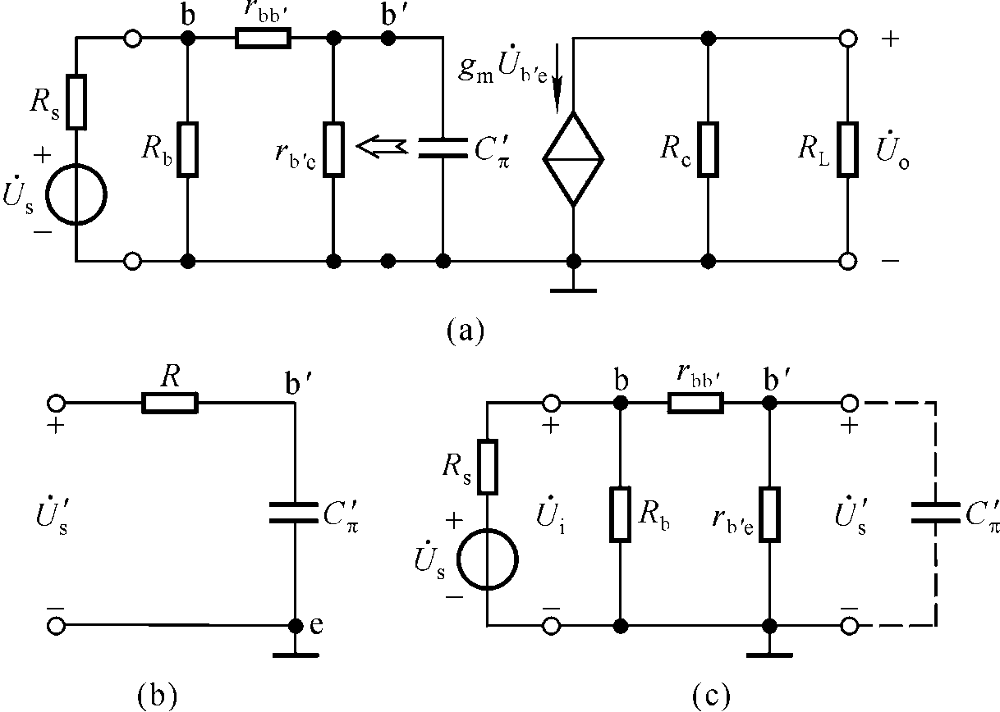

### 第29页：4. 电压放大倍数的波特图
全频段放大倍数表达式：
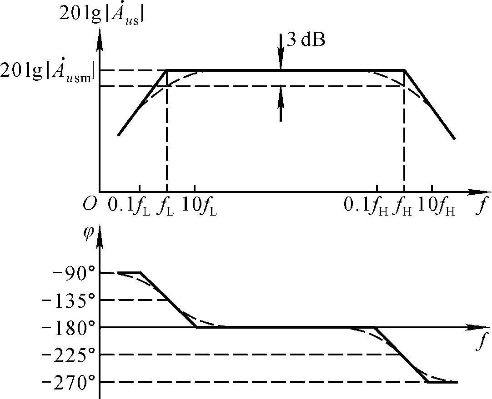

### 第30页：5. 带宽增益积：定性分析
fbw＝ fH－ fL≈ fH
矛盾
当提高增益时，带宽将变窄；反之，增益降低，带宽将变宽。

### 第31页：5. 带宽增益积：定量分析
若rbe<<Rb、 Rs<<Rb、 ，则可以证明图示电路的
说明决定于管子参数
对于大多数放大电路，增益提高，带宽都将变窄。
要想制作宽频带放大电路需用高频管，必要时需采用共基电路。
约为常量
根据

### 第32页：二、多级放大电路的频率响应
1. 讨论： 一个两级放大电路每一级（已考虑了它们的相互影响）的幅频特性均如图所示。
6dB
3dB
fL
fH
≈0.643fH1
fL> fL1， fH< fH1，频带变窄！

### 第33页：2. 多级放大电路的频率响应与各级的关系
对于n级放大电路，若各级的下、上限频率分别为fL1～ fLn、 fH1～ fHn，整个电路的下、上限频率分别为fL、 fH，则
由于
求解使增益下降3dB的频率，经修正，可得
1.1为修正系数

### 第34页：讨论一
1. 信号频率为0～∞时电压放大倍数的表达式？
2. 若所有的电容容量都相同，则下限频率等于多少？

### 第35页：时间常数分析：
C2、Ce短路， 开路，求出
C1、Ce短路， 开路，求出
C1、C2短路， 开路，求出
C1、 C2、 Ce短路，求出
若电容值均相等，则τe<< τ1、τ2
无本质区别

### 第36页：讨论二
1. 该放大电路为几级放大电路?
2. 耦合方式?
3. 在 f ＝104Hz 时，增益下降多少？附加相移φ’＝？
4. 在 f ＝105Hz 时，附加相移φ’≈？
5. 画出相频特性曲线；
6. fH＝？
已知某放大电路的幅频特性如图所示，讨论下列问题：
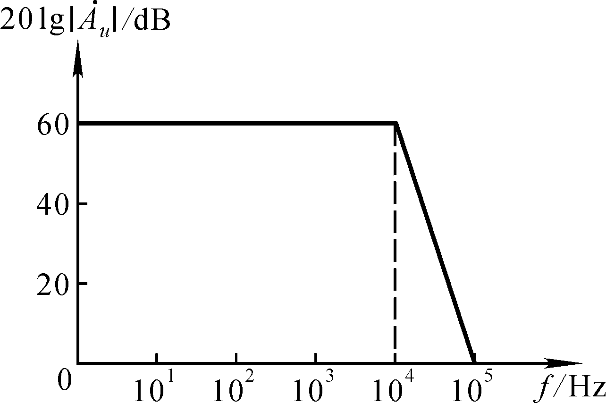

### 第37页：讨论三：两级阻容耦合放大电路的频率响应
原文不清晰

### 第38页：第38页
原文不清晰

## 关键概念
- 模拟电子技术基础 Fundamentals of Analog Electronic
- 第五章 放大电路的频率响应
- §4.1 频率响应的有关概念
- 一、研究的问题
- 二、高通电路和低通电路
- 三、放大电路中的频率参数
- §4.2 晶体管的高频等效电路
- 一、混合π模型

## 重要知识点
- 模拟电子技术基础 Fundamentals of Analog Electronic
- 第四章 放大电路的频率响应
- 第五章 放大电路的频率响应
- §4.1 频率响应的有关概念
- §4.2 晶体管的高频等效电路
- §4.3 放大电路的频率响应
- §4.1 频率响应的有关概念
- 一、本章要研究的问题
- 二、高通电路和低通电路
- 三、放大电路中的频率参数
- 一、研究的问题
- 放大电路对信号频率的适应程度，即信号频率对放大倍数的影响。

## 复习提纲
1. 先通读“内容概览”和“关键概念”。
2. 按“详细笔记”逐页复盘，重点关注定义、结论、步骤。
3. 对照“重要知识点”进行口头复述和默写。

## 自测题
1. 本文档中最核心的 3 个概念是什么？
2. 任选一页，概述其关键知识点与应用场景。
3. 哪些内容在原文中不清晰，需要回看课件？
